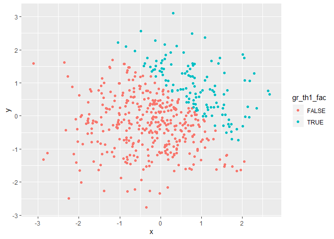

p8105\_hw1\_jsg2145
================
Jared Garfinkel
9/17/2019

# Data Science I P8104

I am in Data Science I P8104.

## HW1

This is my first homework assignment.

### Problem 1

This is the first problem of the problem set. Load the
    library.

``` r
library(tidyverse)
```

    ## -- Attaching packages ------------------------------------------------------------------------------------ tidyverse 1.2.1 --

    ## v ggplot2 3.2.1     v purrr   0.3.2
    ## v tibble  2.1.3     v dplyr   0.8.3
    ## v tidyr   0.8.3     v stringr 1.4.0
    ## v readr   1.3.1     v forcats 0.4.0

    ## -- Conflicts --------------------------------------------------------------------------------------- tidyverse_conflicts() --
    ## x dplyr::filter() masks stats::filter()
    ## x dplyr::lag()    masks stats::lag()

Here’s a dataframe.

``` r
df1 = tibble(
  samp = rnorm(8),
  samp_pos = samp > 0,
  char_vec = c("This", "is", "a", "vector", "of", "length", "eight", "characters"),
  fact_vec = factor(c("fac1", "fac2", "fac3", "fac4", "fac5", "fac6", "fac7", "fac8")))
```

Take the mean of each vector:

I can take the mean of samp = -0.7153819

I can take the mean of samp\_pos = 0, but it won’t tell me much

The mean of a character vector doesn’t make sense, NA

Neither does one for a factor, NA

``` r
as.numeric(pull(df1, samp_pos))
as.numeric(pull(df1, char_vec))
as.numeric(pull(df1, fact_vec))
```

My logical vector was converted to zeros and ones, whereas my character
vector was converted to NAs “by coercion”.

My factors were unassigned, so they were also NA.

``` r
prod(as.numeric(pull(df1, samp_pos)), pull(df1, samp))
prod(as.factor(pull(df1, samp_pos)), pull(df1, samp))
prod(as.numeric(as.factor(pull(df1, samp_pos))), pull(df1, samp))
```

# Problem 2

Create a second dataframe.

``` r
df2 = tibble(
  x = rnorm(500),
  y = rnorm(500),
  gr_th1 = x + y > 1,
  gr_th1_num = as.numeric(gr_th1),
  gr_th1_fac = factor(gr_th1)
)
```

The size of this dataframe is 500 rows by 5 columns.

The mean of x is -0.0316304, the median of x is -0.0125446, and

the standard deviation of x is 1.0019866. The proportion of cases for
which x + y \> 1

is 124 / 500\`.

``` r
df2_good <- df2 %>% 
  mutate(
    gr_th1_fac = factor(gr_th1_fac,
                        labels = c("No", "Yes"))) %>% 
  labs(fill = "Sum is greater than 1")
with(df2_good, 
     plot(x = pull(df2_good, x), y = pull(df2_good, y)))
```

``` r
ggplot(data = df2,
       aes(x, y, color = gr_th1_fac)) +
  geom_point()
```

<!-- -->

labs(title = “Random Normal Samples”, legend(x = “topleft”, legend =
ifelse( pull(df2, gr\_th1\_fac) == TRUE, “Sum not greater than 1”, “Sum
greater than 1”)))

``` r
with(df2, 
     plot(x, y))
with(
  filter(df2, gr_th1 == TRUE),
  points(x, y, col = 'red'))
with(
  filter(df2, gr_th1 == FALSE),
  points(x, y, col = 'blue'))
legend("bottomleft", pch= 1, col=c("blue","red"), legend=c("Sum not greater than 1","Sum greater than 1"))
```

<!-- -->
