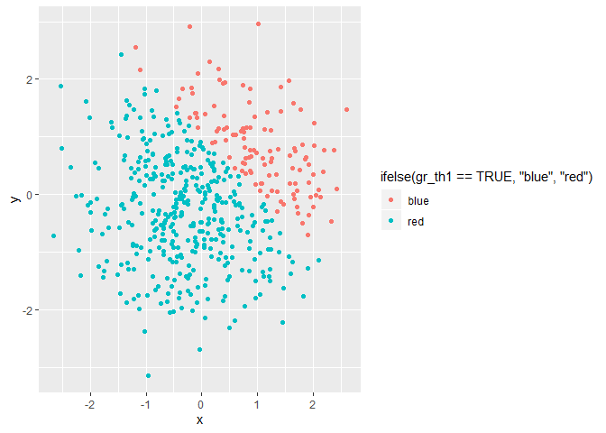

p8105\_hw1\_jsg2145
================
Jared Garfinkel
9/17/2019

# Data Science I P8104

I am in Data Science I P8104.

## HW1

This is my first homework assignment.

### Problem 1

This is the first problem of the problem set. Load the
    library.

``` r
library(tidyverse)
```

    ## -- Attaching packages ------------------------------------------------------------------------------------ tidyverse 1.2.1 --

    ## v ggplot2 3.2.1     v purrr   0.3.2
    ## v tibble  2.1.3     v dplyr   0.8.3
    ## v tidyr   0.8.3     v stringr 1.4.0
    ## v readr   1.3.1     v forcats 0.4.0

    ## -- Conflicts --------------------------------------------------------------------------------------- tidyverse_conflicts() --
    ## x dplyr::filter() masks stats::filter()
    ## x dplyr::lag()    masks stats::lag()

Here’s a dataframe.

``` r
df1 = tibble(
  samp = rnorm(8),
  samp_pos = samp > 0,
  char_vec = c("This", "is", "a", "column", "of", "length", "eight", "characters"),
  fact_vec = factor(samp, levels = list("factor1", "factor2", "factor3")))
```

Take the mean of each vector:

I can take the mean of samp = 0.6404732

I can take the mean of samp\_pos = 0.625, but it won’t tell me much

The mean of a character vector doesn’t make sense, NA

Neither does one for a factor, NA

``` r
as.numeric(pull(df1, samp_pos))
as.numeric(pull(df1, char_vec))
as.numeric(pull(df1, fact_vec))
```

My logical vector was converted to zeros and ones, whereas my character
vector was converted to NAs “by coercion”.

My factors were unassigned, so they were also NA.

``` r
prod(as.numeric(pull(df1, samp_pos)), pull(df1, samp))
prod(as.factor(pull(df1, samp_pos)), pull(df1, samp))
prod(as.numeric(as.factor(pull(df1, samp_pos))), pull(df1, samp))
```

# Problem 2

Create a second dataframe.

``` r
df2 = tibble(
  x = rnorm(500),
  y = rnorm(500),
  gr_th1 = x + y > 1,
  gr_th1_num = as.numeric(gr_th1),
  gr_th1_fac = factor(gr_th1)
)
```

The size of this dataframe is 500 rows by 5 columns.

The mean of x is -0.0512693, the median of x is -0.0284383, and

the standard deviation of x is 1.0072263. The proportion of cases for
which x + y \> 1

is 0.234.

``` r
cols <- c("blue" = "x + y <= 1", "red" )

ggplot(data = df2, 
       aes(x, y,
           color = ifelse(gr_th1 == TRUE, "blue", "red"),
           manual_fill_)) +
  geom_point(data = df2, aes(x, y)) +
  theme(legend.position = "top", legend.title = element_blank())
```

<!-- -->
